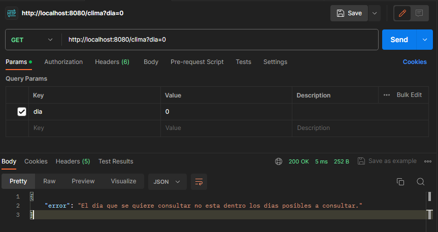
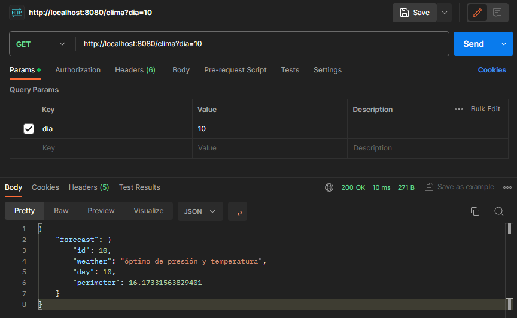
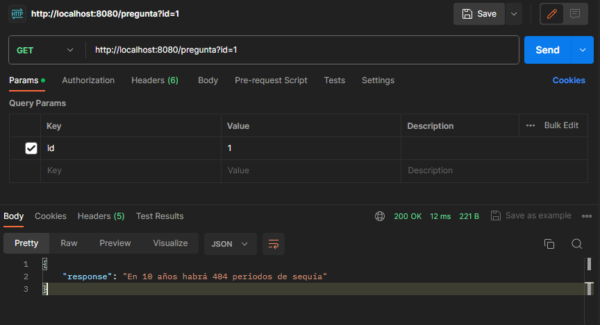

# Challenge-Abstract

## Enunciado:
En una galaxia lejana, existen tres civilizaciones. Vulcanos, Ferengis y Betasoides. Cada civilización
vive en paz en su respectivo planeta.

Dominan la predicción del clima mediante un complejo sistema informático.

## Premisas:
● El planeta Ferengi se desplaza con una velocidad angular de 1 grado por día en sentido
horario. Su distancia con respecto al sol es de 500km.

● El planeta Betasoide se desplaza con una velocidad angular de 3 grados por día en sentido
horario. Su distancia con respecto al sol es de 2000km.

● El planeta Vulcano se desplaza con una velocidad angular de 5 grados por día en sentido
anti-horario. Su distancia con respecto al sol es de 1000km.

Todas las orbitas son circulares.
Cuando los tres planetas están alineados entre sí y a su vez alineados con respecto al sol, el
sistema solar experimenta un periodo de sequía. Cuando los tres planetas no están alineados,
forman entre si un triángulo. Es sabido que en el momento en el que el sol se encuentra dentro del
triángulo, el sistema solar experimenta un periodo de lluvia, teniendo este, un pico de intensidad
cuando el perímetro del triángulo está en su máximo. Las condiciones óptimas de presión y
temperatura se dan cuando los tres planetas están alineados entre sí, pero no están alineados con
el sol.

## Realizar:
Un programa informático para poder predecir en los próximos 10 años:

● ¿Cuántos periodos de sequía habrá?

● ¿Cuántos periodos de lluvia habrá y que día será el pico máximo de lluvia?

● ¿Cuántos periodos de condiciones óptimas de presión y temperatura habrá?

Generar un modelo de datos con las condiciones de todos los días hasta 10 años en adelante
utilizando un job para calcularlas. Generar una API REST la cual devuelve en formato JSON la
condición climática del día consultado.
Generar y adjuntarla documentación considerada necesaria e importante.

## Requerido: 
Utilizar Java/Spring

## Extra:
● Hostear el modelo de datos y la API REST en un cloud computing libre y enviar la URL
para consultar el clima de un día en particular

# Decisiones tomadas:
- Como se desea realizar un programa que pueda predecir los próximos 10 años, y la cantidad de días que conforman un año no fue aclarada, asumí que un año equivale a 365 días.
- Para tener una persistenca de datos, decidí usar h2 y en "application.properties" podrán encontrar seteada las información necesaría para poder ingresar a h2-console.

- Realicé un endpoint aparte para poder obtener respuesta de las preguntas realizadas.

  http://localhost:8080/pregunta?id=1 (1,2 o 3 dependiendo de la respuesta que se desee)
- Al no poder realizar un job para cargar la base de datos, utilicé la anotacion @Beans para realizarlo.
- Decidí no permitir el ingreso de parametros inválidos.
Por ejemplo:

- 

## Tareas no alcanzadas:
- Realizar el job.
- Realizar el Extra.c

# Funcionamiento:
- Descargar el repositorio y correrlo.
- Mientras se levanta localhost, se cargará automatizamente la base de datos en h2.
- Realizar alguna pegada a algunos de los endpoint a disposicion:

## Obtener Clima del dia desado:
- Devolverá la condición climática del día consultado en un formato Json.
Ejemplo:
- http://localhost:8080/clima?dia=10

## Obtener respuesta:
- Devolverá la respuesta a las tres preguntas que se hicieron en el enunciado.
Ejemplo:
- http://localhost:8080/pregunta?id=1

